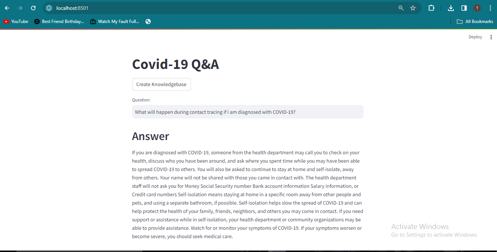

# Covid-19 Q&A: Question and Answer System Based on Google Gimini Pro LLM and Langchain for Covid 19 

This is an end to end LLM project based on Gimini Pro and Langchain. We are building a Q&A system for covid 19. This system will provide a streamlit based user interface for people where they can ask questions and get answers about covid 19. 



## Project Highlights

- Use a real CSV file of FAQs that Codebasics company is using right now. 
- Their human staff will use this file to assist their course learners.
- We will build an LLM based question and answer system that can reduce the workload of their human staff.
- Students should be able to use this system to ask questions directly and get answers within seconds

## You will learn following,
  - Langchain + Gimini pro : LLM based Q&A
  - Streamlit: UI & Flask(final Deploy)
  - Huggingface instructor embeddings: Text embeddings
  - FAISS: Vector databse

```
## Usage

1. Run the Streamlit app by executing:
```bash
streamlit run main.py

```

2.The web app will open in your browser.

- To create a knowledebase of FAQs, click on Create Knolwedge Base button. It will take some time before knowledgebase is created so please wait.

- Once knowledge base is created you will see a directory called faiss_index in your current folder

- Now you are ready to ask questions. Type your question in Question box and hit Enter

## Sample Questions
  - Can mosquitoes or ticks spread the virus that causes COVID-19?,"
  - How can I keep my children healthy?
  - What additional steps should families that have a child with an underlying medical condition take?
  - Can wild animals spread the virus that causes COVID-19 to people or pets?
  - Is cleaning alone effective against the virus that causes COVID-19?

## Project Structure

- main.py: The main Streamlit application script.
- langchain_helper.py: This has all the langchain code
- requirements.txt: A list of required Python packages for the project.
- .env: Configuration file for storing your Google API key.
